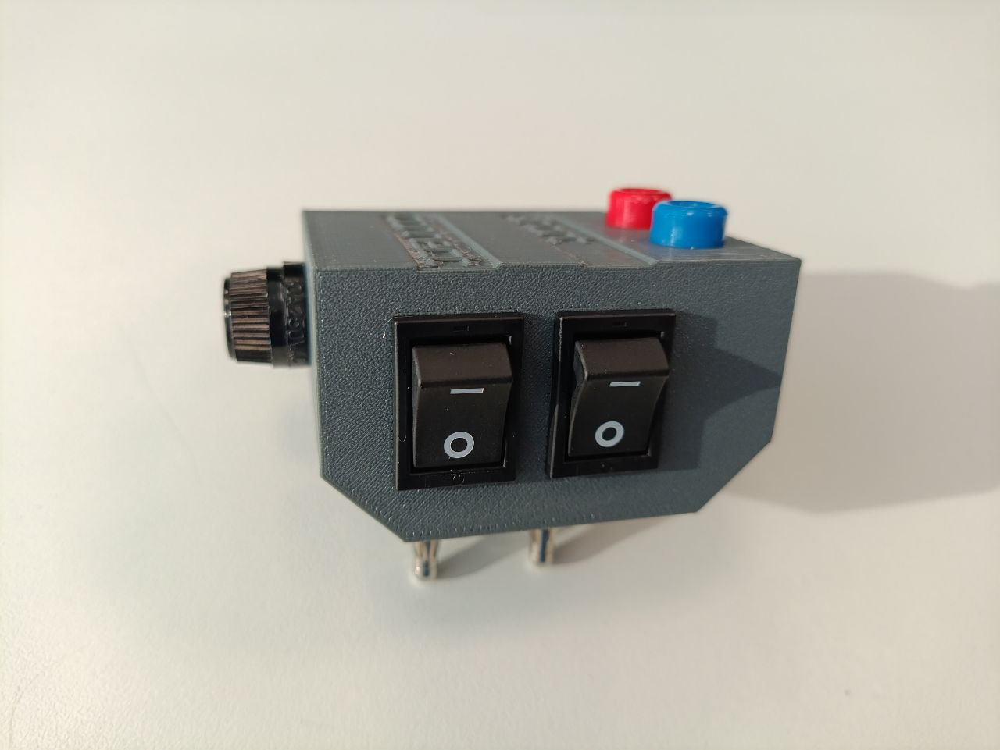
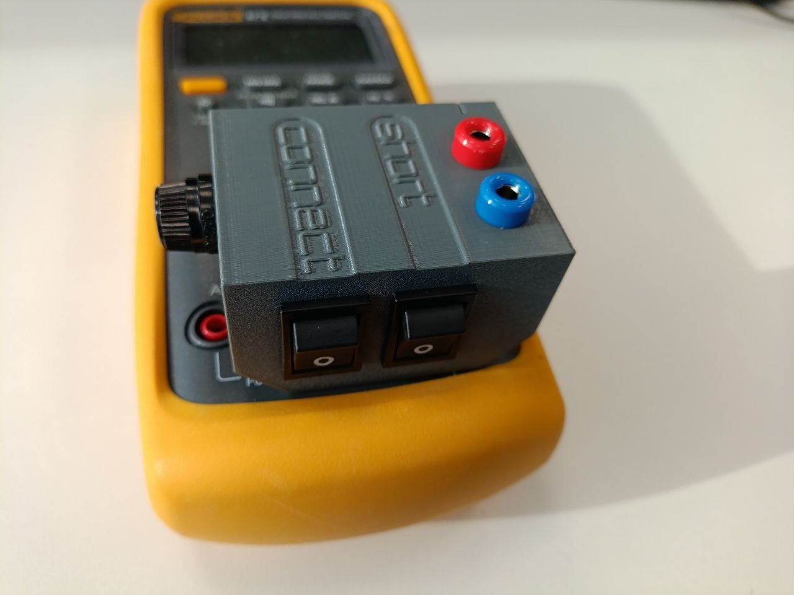
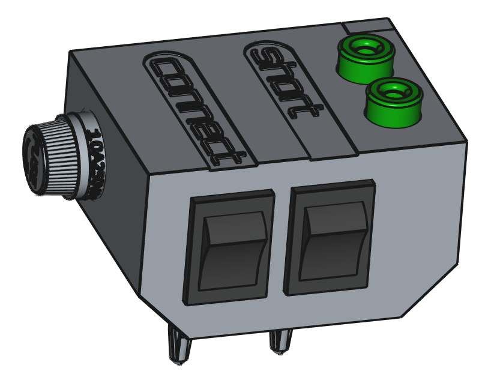
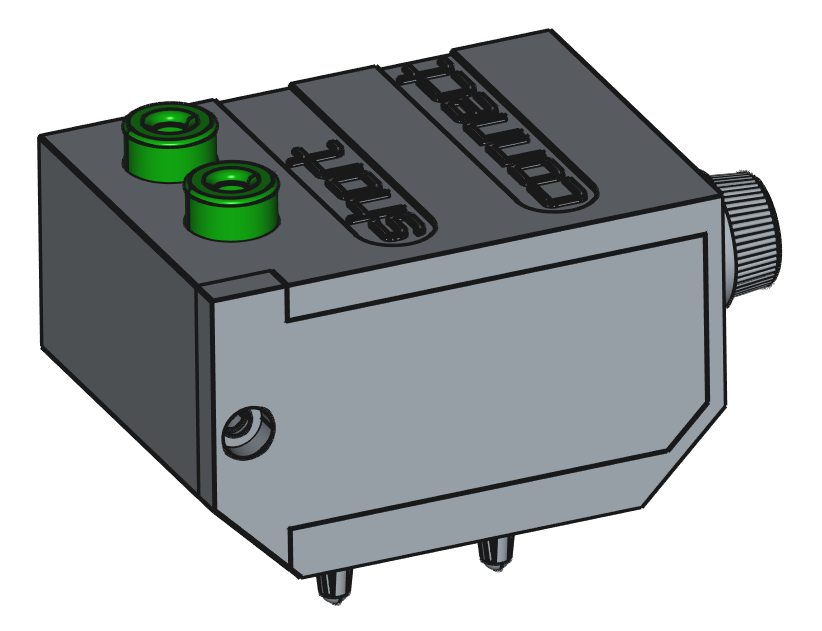
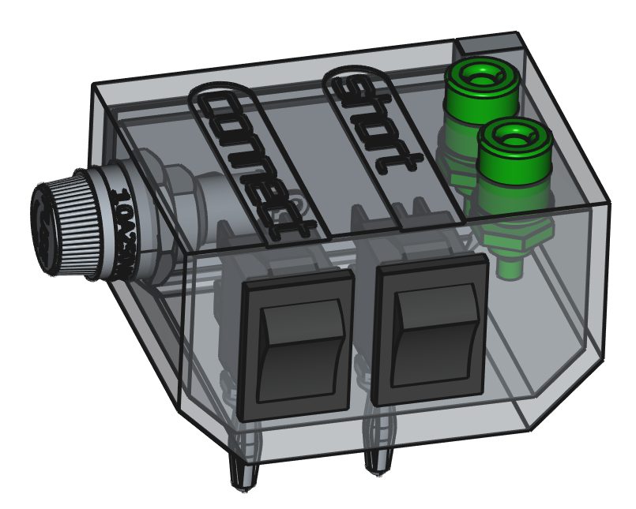
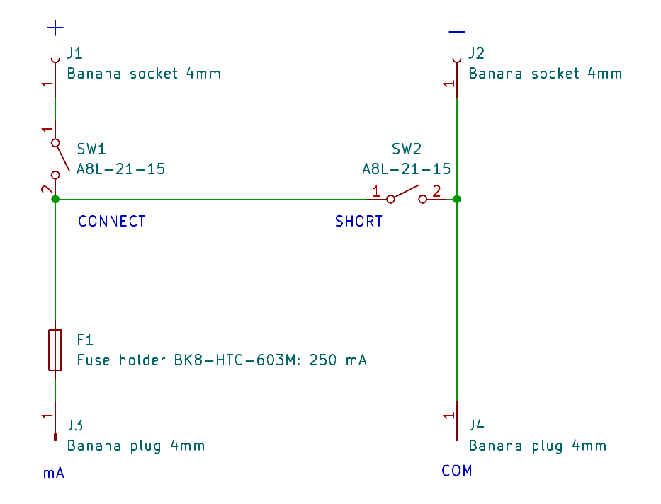
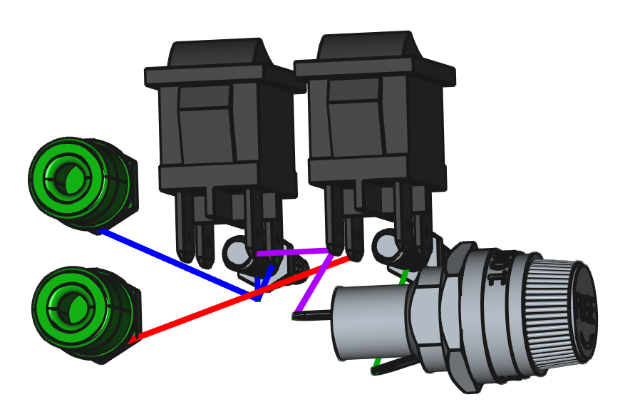

# Module for Fluke 87V Multimeter

## Description

This module connects to the "COM" and "mA" inputs of the Fluke 87V multimeter. It allows you to:

- Disconnect the power source from the tested circuit.
- Short the multimeter's internal current shunt.
- Protect the multimeter using an external fuse.

Partially parametrized via spreadsheet in FreeCAD project.

## Printing

The enclosure was 3D printed using 0.2 mm layer height PETG filament.  
Threading for an M3 screw should be cut manually after printing.

## Images

### Photos

### Drawings

### Schematic

### Wiring

## Bill of Materials (BOM)

| Designator  | Description           | Value         | Qty | Farnell Code  | Note                        |
|-------------|-----------------------|---------------|-----|---------------|-----------------------------|
| F1          | Fuse holder           | BK8-HTC-603M  | 1   | 3769131       |                             |
|             | Fast fuse             | 250 mA        | 1   | 3515934       |                             |
| J1, J2      | Banana socket 4mm/M6  |               | 2   | 1698955       |                             |
|             | Solder washer M6      |               | 2   | 2832547       |                             |
|             | Star lock washer M6   |               | 2   |               |                             |
| J3, J4      | Banana plug 4mm       | FK 1210 NI    | 2   | 3224621       |                             |
|             | Solder washer M4      |               | 2   | 2832545       |                             |
|             | Nylon lock nut M4     |               | 2   |               |                             |
| SW1, SW2    | DPST switch           | A8L-21-15     | 2   | 2213918       | SPST won't fit mechanically |
|             | Blade connector 4.8   |               | 4   |               |                             |
